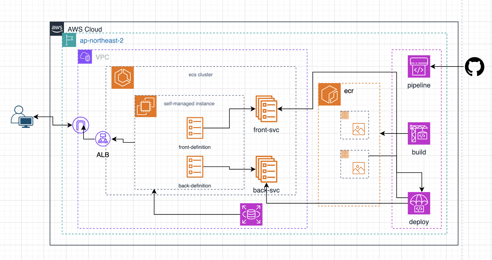

# Project-2

### 개요 : ECS 기반 컨테이너 배포 환경 구축

project-1의 단일 EC2 기반 서비스 환경을 컨테이너 기반 아키텍처로 전환하고 ECS을 활용하여 장애 복구, 자동 확장, 무중단배포 가능한 고가용성 인프라를 구축 했습니다.

---

### 아키텍처



---

### 사용법

테라폼을 활용하여 인프라를 생성합니다.

```zsh
terraform init
terraform plan
terraform apply
```

---

### Infrastructure as Code

aws provider을 지원하는 Terraform을 활용하여 VPC, Security Group, ALB, ECS , Auto Scaling Group , IAM Role 리소스 구축

- 콘솔 수작업 최소화를 통한 휴먼 에러 감소
- 인프라 변경 이력 관리 문서화
- 동일한 인프라 환경 재현 가능

---

### 기존 EC2 단일 배포 환경의 한계

project-1의 기존 환경의 문제점

- 장애 발생 시 서비스 중단
- 서비스 규모가 증가할 경우 확장성 가용성 측면에서 한계가 있었습니다.
- ec2 장애 발생 시 수동 복구 필요

---

### 컨테이너 기반 컨테이너 오케스트레이션

ECS는 컨테이너 애플리케이션을 쉽게 배포, 관리 및 확대할 수 있도록 도와주는 완전 관리형 컨테이너 오케스트레이션 서비스입니다.

**왜 ECS를 선택했는가?**

- 장애 발생 시 자동 복구
- 서비스 가용성 향상
- 운영 부담 감소
- AWS 완전 관리형 서비스
- ALB, CloudWatch, Auto Scaling 연동 용이
- MVP 단계 서비스에 적합

---

### ECS Service Auto Scaling

트래픽이 증가할 때마다 직접 Task 수를 조정하는 것은 운영 부담이 크고 대응 속도가 느립니다

ECSServiceAverageCPUUtilization 지표를 대상으로 Target Tracking Scaling을 구현했습니다

- 트래픽 자동 대응
- 리소스 비용 절감

---

### ECS Capacity Provider + Auto Scaling Group

ECS Service Auto Scaling은 Task 개수를 늘려줄 수 있지만, Task를 실행할 EC2 인스턴스를 자동으로 늘려주지는 않습니다.

예를 들어 CPU 사용률 증가로 인해 Desired Count가 2개에서 10개로 증가하더라도 클러스터에 충분한 EC2 리소스가 없다면 Task는 `PENDING` 상태로 남게 됩니다.

현재 용량 공급자는 세가지

1. fargate only
2. fargate and managed instances
3. fargate and self-managed instances

이 프로젝트에선 특정 인스턴스 유형과 지정 AMI가 필요하기 때문에 **Fargate and Self-managed instances** 선택을했습니다.

|                    | Managed Instances           | EC2 Auto Scaling(self-managed instances) |
| ------------------ | --------------------------- | ---------------------------------------- |
| Launch Template    | AWS 관리                    | 직접 관리                                |
| Auto Scaling Group | AWS 관리                    | 직접 관리                                |
| 패치               | AWS 관리                    | 직접 관리                                |
| 인스턴스 타입      | Use ECS default, Use custom | 직접 관리                                |
| Spot               | 지원                        | 지원                                     |

---

### Amazon ECR

Frontend와 Backend 이미지를 Amazon ECR Private Repository에서 관리했습니다.

- Vulnerability Scanning - 취약점 사전 점검

---

### Container Insights 기반 모니터링 환경 구축

CloudWatch Container Insights를 활성화하여 ECS 클러스터 및 개별 컨테이너 레벨까지 모니터링했습니다.

#### Container Insight Metrics

| Metric             |       Value |
| ------------------ | ----------: |
| CPU utilization    |      0.356% |
| Memory utilization |        0.1% |
| Network RX         | 166 bytes/s |
| Network TX         | 150 bytes/s |
| Storage Read       |   0 bytes/s |
| Storage Write      |  8.192 KB/s |
| Service Tasks      |     1 count |

#### ECS Metrics

| Metric             |  Value |
| ------------------ | -----: |
| CPU utilization    | 0.732% |
| Memory utilization | 0.342% |

- 태스크 수준 문제 해결
- 컨테이너 수준 리소스 최적화
- 컨테이너 상태 평가
- 애플리케이션 성능 모니터링
- 작업 모니터링

---

### CI/CD 구현

AWS CodeSeries 중에 CodeCommit을 github으로 대체후 CICD 파이프라인을 구축

- CodePipeline -> 소스 리포지토리에 변경을 가하면 CodePipeline이 자동으로 변경 내용을 감지. 그러한 변경 내용을
  빌드하고 테스트를 구성하는 경우에는 테스트를 실행후 서버로 배포
- CodeBuild -> 도커 빌드후 ecr에 이미지 push
- CodeDeploy -> 업데이트된 이미지로 ecs service로 자동배포

---

### 무중단 배포

ECS서비스의 스케줄러가 task의 상태 이상을 감지하며 관리한다.

#### Rolling Update(default)

- 서비스 다운타임을 없애기 위해 신규 버전의 Task를 먼저 실행하고, ALB가 정상 헬스 체크를 확인한 후 구버전 Task를 단계적으로 종료

- Deployment Circuit Breaker & Automatic Rollback: 신규 배포 중 애플리케이션 에러로 인해 헬스 체크가 지속적으로 실패할 경우, 배포를 즉시 중단하고 수동 개입 없이 직전의 안정적인 버전으로 자동 롤백되 작업이 안정 상태에 도달하는지 확인하는 메커니즘를 가지고 있다.

배포 실패 시에도 수동 개입 없이 서비스를 복구할 수 있었으며(자동장애조치), 안정적인 운영과 높은 가용성을 확보했습니다.
