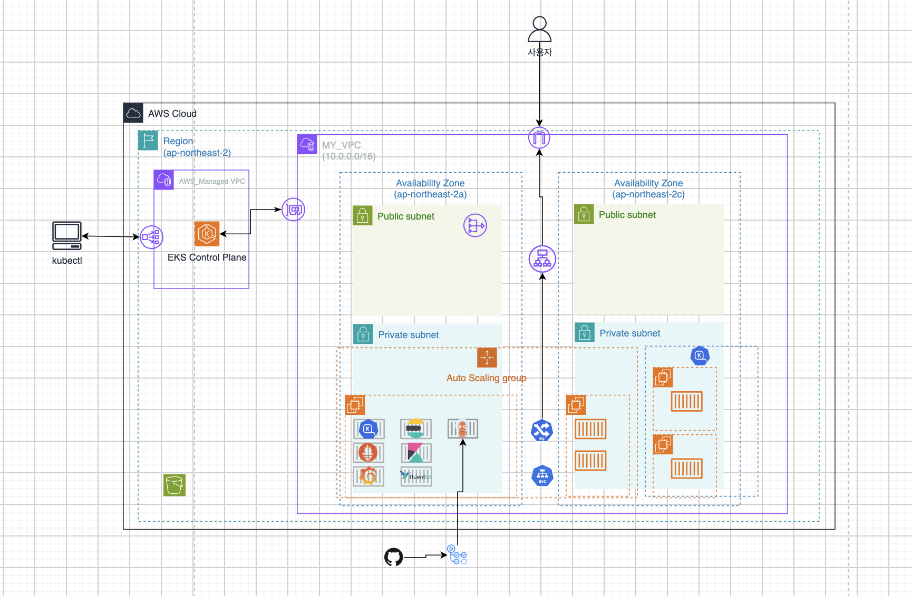

# Project-3

### 개요: EKS 기반 kubernetes 운영 환경 구축

Terraform으로 AWS 인프라를 코드화하고 EKS 기반의 애플리케이션의 배포,확장,장애대응 및 Observability 운영환경을 구성한 프로젝트입니다.
Prometheus/Grafana를 이용한 Metrics 모니터링과 Fluent Bit/Elasticsearch/Kibana를 이용한 Logging 환경을 구축하고 나만의 SLI/SLO 및 Alerting을 통해 서비스 상태를 지속적으로 관찰하고 장애발생시 원인을 추적할 수 있는 운영 환경을 구현했습니다.

---

### 아키텍처



---

### 사용법

테라폼을 활용하여 인프라를 생성합니다

### Terraform

```zsh
terraform init
terraform plan
terraform apply
```

### kubeconfig 설정

```zsh
aws eks update-kubeconfig --region <region> --name <cluster-name>
```

### Kubernetes Manifest 배포

Kubernetes 운영 구성 요소와 애플리케이션은 Helm 및 Kubernetes Manifest를 통해 배포합니다.

- [Kubernetes Manifest 설치](./manifest/README.md)

## Infrastructure as Code

Terraform을 사용해 AWS 인프라를 코드로 관리

- 콘솔 수작업 최소화를 통한 휴먼 에러 감소
- 인프라 구성의 코드화
- 동일한 인프라 환경 재현

## 컨테이너 운영 환경 확장

서비스가 복잡해지고 운영해야 하는 컨테이너가 증가하면 다음과 같은 요구사항이 발생합니다.

- 컨테이너 배포 및 관리 복잡도 증가
- 장애 발생 시 대응
- 로그 및 Metrics 통합 관리
- 워크로드 분산
- 운영 환경의 표준화

Kubernetes는 이러한 요구사항을 선언적인 방식으로 관리할 수 있고  
다양한 생태계 도구와 결합하여 운영 환경을 확장할 수 있습니다.

## Amazon EKS 클러스터 구성

- EKS Control Plane은 AWS가 관리

- Kubernetes API에 접근할 수 있도록 Kubernetes API Server의 Public Endpoint 활성화

- Worker Node는 Private Subnet에 배치하여 외부에서 Node에 직접 접근할 수 없도록 구성

### 클러스터 노드 구성

- EKS Managed Node Group의 **EC2 Instance Type**을 `t3.micro`, `t3.small` 으로 구성
- 동적인 Node Provisioning은 Karpenter를 통해 처리

| add-ons                |                                       |
| ---------------------- | ------------------------------------- |
| CoreDNS                | Kubernetes 내부 DNS 제공              |
| VPC CNI                | AWS VPC 네트워크와 Pod 네트워크 구성  |
| kube-proxy             | Kubernetes Service 네트워크 처리      |
| EKS Pod Identity Agent | Pod의 AWS 리소스 접근을 위한 IAM 연동 |
| Metrics Server         | Pod/Node 리소스 Metrics 제공          |

## Kubernetes 운영 환경 구성

Kubernetes 운영에 필요한 구성 요소는 helm으로 설치 및 관리하고, 그외의 것들은 yaml로 선언적으로 관리했습니다.

| helm                         |                                   |
| ---------------------------- | --------------------------------- |
| AWS Load Balancer Controller | Kubernetes Ingress와 AWS ALB 연동 |
| cert-manager                 | TLS 인증서 자동 발급/갱신         |
| EBS CSI Driver               | EBS와 PVC/PV 연동                 |
| kube-prometheus-stack        | Metrics 수집/시각화               |
| EFK                          | 로그 수집/검색/시각화             |
| Argo CD                      | gitops 배포 자동화                |
| myapp                        | 애플리케이션                      |

### EBS 스토리지 비용 성능 최적화

|                  | gp2             | gp3                                                                           |
| ---------------- | --------------- | ----------------------------------------------------------------------------- |
| Volume size      | 1 GiB – 16 TiB  | 1 GiB – 64 TiB                                                                |
| IOPS             | 3 IOPS/GiB      | 3,000 IOPS                                                                    |
| 볼륨당 최대 IOPS | 16,000          | 80,000                                                                        |
| GiB당 가격       | $0.10/GiB-month | $0.08/GiB-month 3,000 IOPS free and $0.005/provisioned IOPS-month over 3,000; |

스토리지 비용 절감과 용량과 성능을 고려하여 default StorageClass를 `gp3`로 설정

---

### kubernetes 워크로드 운영 설정

#### 1. 리소스 관리

애플리케이션 Pod에 CPU/Memory의 requests와 limits를 설정했습니다.

- requests: Scheduler가 Pod를 배치할 때 기준으로 사용하는 필요 리소스
- limits: 컨테이너가 사용할 수 있는 리소스의 상한
- CPU와 Memory의 requests/limits를 애플리케이션 Pod가 Burstable QoS 조건을 만족하도록 구성.

이를 통해 특정 Pod의 과도한 리소스 사용이 동일 노드의 다른 워크로드에 영향을 주는 상황을 줄이고, 스케쥴러가 Pod를 더 적절한 노드에 배치할 수 있게 했습니다.

#### 2. health check

애플리케이션의 상태를 확인하기위해 probe 구성했습니다.

- livenessProbe: `failureThreshold=3` 반복적으로 실패하면 kubelet은 해당 컨테이너를 재시작한다
- readinessProbe: 트래픽을 받을 준비가 되었는지 판별하고 실패상태를 반환하면 해당 파드를 서비스 엔드포인트에서 제외한다.

#### 3.애플리케이션 노드 분산 전략

단일 노드 장애 시 전체 서비스가 정지될 수 있는 문제를 해결하기 위한 pod 배치 전략

- `topologySpreadConstraints`: 동일 애플리케이션의 pod들이 서로 다른 worker node에 균등 분산 배치되도록 구성했습니다.  
   단일 노드/AZ 장애시 장애 영향 최소화 및 가용성 향상

## autoscaling

### 1. Horizontal Pod Autoscaling (pod단위 확장)

- Horizontal Pod Autoscaler를 적용하여 애플리케이션 Pod의 리소스 사용량에 따라 Replica 수를 자동으로 조정했습니다.
- CPU 및 Memory 사용량을 기준으로 Scale Out / Scale In하도록 구성하여 트래픽 및 워크로드 변화에 대응할 수 있도록 했습니다.

### 2. Karpenter (노드 단위 프로비저닝)

HPA에 의해 Pod가 증가하더라도 기존 Worker Node의 CPU 또는 Memory가 부족하면 새로운 Pod가 Pending 상태가 될 수 있습니다.

이 문제를 해결하기 위해 Karpenter를 구성했습니다

- Karpenter는 Pending 상태의 Pod가 요구하는 리소스와 NodePool의 조건을 기반으로 적절한 EC2 Instance를 선택하여 Node를 Provisioning합니다.
- Cluster Autoscaler는 고정된 Node Group 단위로 확장하는 반면, Karpenter는 Pod 요구사항에 맞춰 즉시 적합한 인스턴스를 선택하고 불필요한 노드를 빠르게 회수할 수 있어 채택
  이를 통해 Pod 수준의 확장과 Node 수준의 확장을 연결했습니다.

| karpenter nodepool |             |
| ------------------ | ----------- |
| instance type      | 시간당 비용 |
| t3.micro           | USD 0.0104  |
| t3.samll           | USD 0.0208  |
| t3.medium          | USD 0.0416  |

## Ingress 및 AWS ALB 연동

AWS-LB-Controller를 사용하여 Kubernetes Ingress Resource의 선언을 기반으로 AWS ALB를 생성하고 라우팅 규칙을 관리하도록 구성했습니다.  
AWS 콘솔에서 Load Balancer를 개별적으로 구성하는 대신, Kubernetes Resource를 통해 외부 트래픽 라우팅과 애플리케이션 연결 구성을 **선언적**으로 관리했습니다.

## CI/CD

GitHub Actions와 Argo CD를 이용하여 애플리케이션의 코드 변경 사항이 Kubernetes 배포까지 자동화 해주는 GitOps 기반 CI/CD 환경을 구축했습니다.

- **CI**

  git push
  → GitHub Actions
  → Image Build
  → Image Push
  → Helm Values.yml 이미지 태그 변경
  → git push

- **CD**

  Argo CD
  → Git Repository 감지
  → Manifest 변경 감지
  → Kubernetes Cluster 자동 동기화
  → deploy

GitHub Actions는 Image Build와 Manifest 변경을 담당하고, 실제 Kubernetes 배포는 Argo CD가 수행하도록 CI와 CD를 분리했습니다.

## CI/CD

`GitHub Actions`와 `Argo CD`를 활용하여 애플리케이션 코드 변경부터 Kubernetes 배포까지 자동화된 GitOps CI/CD 환경을 구축했습니다.

### CI - GitHub Actions

GitHub Actions를 통해 애플리케이션의 빌드 및 이미지 배포 과정을 자동화했습니다.

1. 코드 변경후 git Push
2. Image Build
3. Image Push
4. Helm `values.yaml`의 Image Tag 변경
5. 변경된 `values.yaml`을 Git Repository에 Push

### CD - Argo CD

Argo CD가 Git Repository를 지속적으로 확인하여 Kubernetes 배포 상태를 자동으로 관리합니다.

- Git Repository 변경 감지
- 변경된 Kubernetes Manifest 자동 동기화
- Kubernetes Cluster에 애플리케이션 배포
- Git Repository와 실제 Cluster 상태를 지속적으로 일치시킴

GitHub Actions는 CI 작업, Argo CD는 CD 작업을 담당하도록 역할을 분리했으며, Git Repository를 배포 상태의 기준(Source of Truth)으로 사용하는 GitOps 구조를 구성했습니다.

---

## Observability

운영 환경에서 문제가 발생했을 떄 이상 현상을 빠르게 감지하고 관련로그를 확인하여 장애 원인을 추적할 수 있는 Observability 환경을 구축했습니다.  
Metrics를 통해 시스템의 이상 현상을 발견하고, Logs를 통해 해당 시점의 실제 애플리케이션 동작을 확인할 수 있도록 구성했습니다.

- 서비스의 이상 징후를 빠르게 탐지
- 사용자 요청 관점에서 서비스 상태 측정
- 장애 발생 시 원인 분석에 필요한 데이터 확보
- Metrics와 Logs를 함께 활용하여 문제 발생 원인 추적

### Metrics

Prometheus가 Kubernetes와 애플리케이션의 Metrics를 수집하고 Grafana를 통해 Dashboard를 구성해 시각화했습니다.

게시판 애플리케이션 특성상, 주로 **읽기(GET)**, **쓰기(POST)** 와 관련된 요청이 많음을 상정하여, **응답 시간**, **가용성**, **에러율** 사용자 경험에 직접적인 영향을 주는 지표를 정해서 성능 보장을 목표했습니다.

서비스의 상태를 측정하기 위해 **SLI → SLO → SLA** 순서로 접근했습니다.

### SLO 기준 설정

1.현재 성능을 기준으로 목표치로 설정하지말것  
2.최대한 단순하게 생각할것  
3.현실성있는 목표치를 설정할것  
4.처음부터 완벽하게 하려고 하지말것  
5. 시스템의 특성을 잘확인할수있는가능한 적은수의 slo를 설정할것 3~5개

### 나만의 SLI/SLO 정의

| SLI              | SLO         |
| ---------------- | ----------- |
| Availability     | 99.99%      |
| GET Latency      | 99% < 300ms |
| POST Latency     | 99% < 500ms |
| Error Rate       | < 1%        |
| DB Query Latency | 99% < 100ms |

### 애플리케이션 커스텀 지표

#### 1. 가용성 (Availability)

서비스의 다운타임을 최소화

- **목표**: `99.99%` 이상의 가용성 ( 서비스 1년 중 `53분` 이하의 다운타임 )

#### 2. 응답 시간 (Latency)

**읽기 요청**(GET) **쓰기 요청**(POST) 사용자 요청의 처리 속도

- **목표**:
  - **읽기 요청** (GET) : `99%`의 요청이 `300ms` 이하로 처리
  - **쓰기 요청** (POST) : `99%`의 요청이 `500ms` 이하로 처리

#### 3. 에러율 (Error Rate)

애플리케이션에서 오류가 발생할 경우 `4xx` (클라이언트 오류)와 `5xx` (서버 오류) 상태 코드의 비율을 에러율로 모니터링

- **목표**: `1%` 이하의 에러율

#### 4. **데이터베이스 성능 (Database Performance)**

데이터베이스 쿼리의 **응답 시간** 모니터링

- **목표**: `99%`의 DB 쿼리 응답 시간이 `100ms`(0.1초) 이하

---

### Grafana dashboard

## 

### Grafana Alerting

Alert Rule을 만들어 임계치를 초과하는 경우 문제를 빠르게 확인할 수 있도록 알림 환경을 구성했습니다.
Grafana Alert에서 서비스 메트릭의 임계치를 기준으로 Alert Rule을 구성하고 Slack bot으로 지정 채널(#alerts-critical)로 알림을 전달하도록 구성

#### Slack 연동 설정

1. **Slack Incoming Webhook 생성**
   - Slack App: `Incoming Webhooks` 활성화
2. **Grafana Contact Point 설정**
   - Alerting → Contact points → + Add contact point
   - Name: `slack-critical`
   - Integration: `Slack`
   - Webhook URL:
   - Channel: `#alerts-critical`

---

### Logging

Metrics만으로는 장애의 원인을 충분히 파악하기 어려운 경우가 있기 때문에 Log를 중앙에서 수집하고 검색할 수 있는 Logging Pipeline을 구성했습니다.

이를 통해 Metrics에서 이상 현상을 발견한 이후 해당 시점의 애플리케이션 로그를 확인하여 문제 발생 원인을 추적하는 환경을 구축했습니다.

Fluent Bit가 Kubernetes 로그를 수집하여 Elasticsearch로 전달하고 Kibana에서 검색 및 분석할 수 있도록 구성했습니다.
Metrics를 통해 장애나 성능 저하 현상을 발견할 수 있지만, Metrics만으로는 실제 원인을 확인하기 어려운 경우가 있습니다.

예를 들어 Response Latency가 증가했다는 사실은 확인할 수 있지만 다음과 같은 원인을 Metrics만으로 정확하게 확인하기 어려울 수 있습니다.

특정 API 오류
Database Connection Error
Application Exception
외부 API 장애
잘못된 요청 처리

이를 해결하기 위해 Kubernetes Container Log를 중앙에서 수집하고 검색할 수 있는 Logging Pipeline을 구성했습니다.

### Fluent Bit

DaemonSet으로 배포하여 각 Node의 Container Log를 수집하고 Elasticsearch로 전달

---

### Elasticsearch

각 Node와 Pod에서 발생하는 Log를 중앙에 저장하여 분산된 Log를 한 곳에서 검색할 수 있도록 구성했습니다.

---

### Kibana

Elasticsearch에 저장된 Log를 Kibana에서 검색하고 분석할 수 있도록 구성했습니다.
Kibana를 통해 특정 timestamp, containername, namespace, field 등의 조건으로 Log를 검색하고 장애 원인을 분석할 수 있도록 구성했습니다.

```
Elasticsearch에 저장된 로그를 Kibana를 통해 검색하고 분석할 수 있도록 구성했습니다.

다음과 같은 정보를 기준으로 장애 상황을 분석할 수 있습니다.

Timestamp
Namespace
Pod Name
Container Name
Error Message
Log Level

Metrics에서 이상 현상을 발견한 뒤 해당 시간대를 기준으로 로그를 검색하여 장애 원인을 분석하는 흐름을 구성했습니다.
```
